# Nuevo UAC-GUI-BYPASS con appverif.exe

Existen multitud de UAC-GUI-BYPASSES y este es otro más que termino de encontrar:

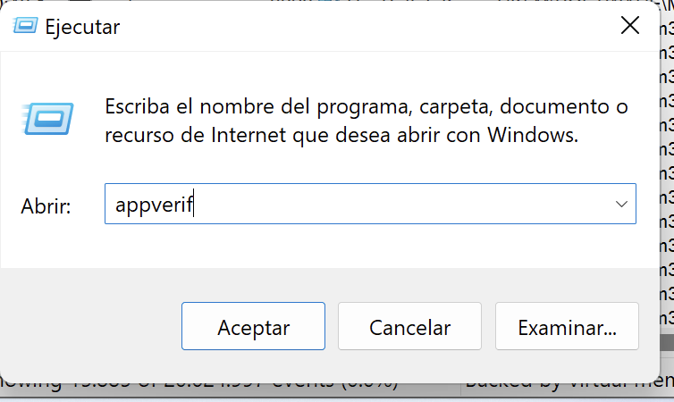

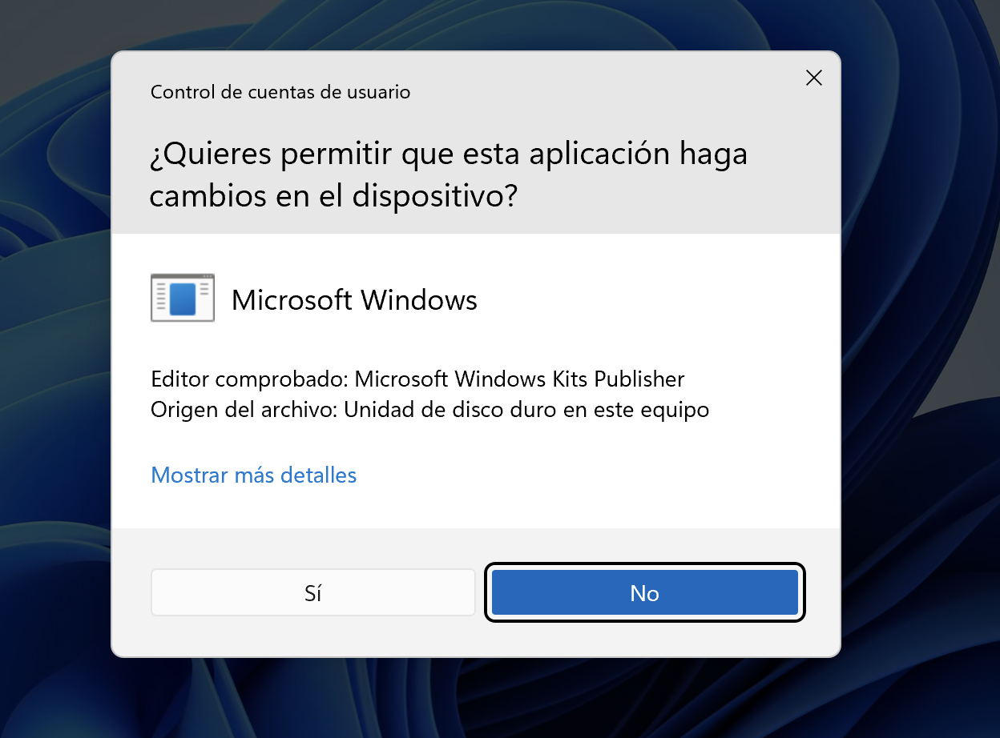

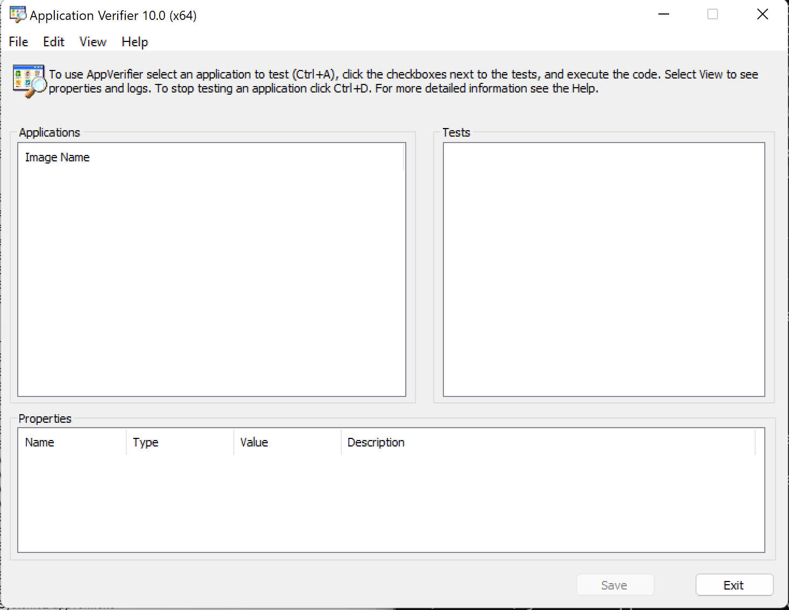

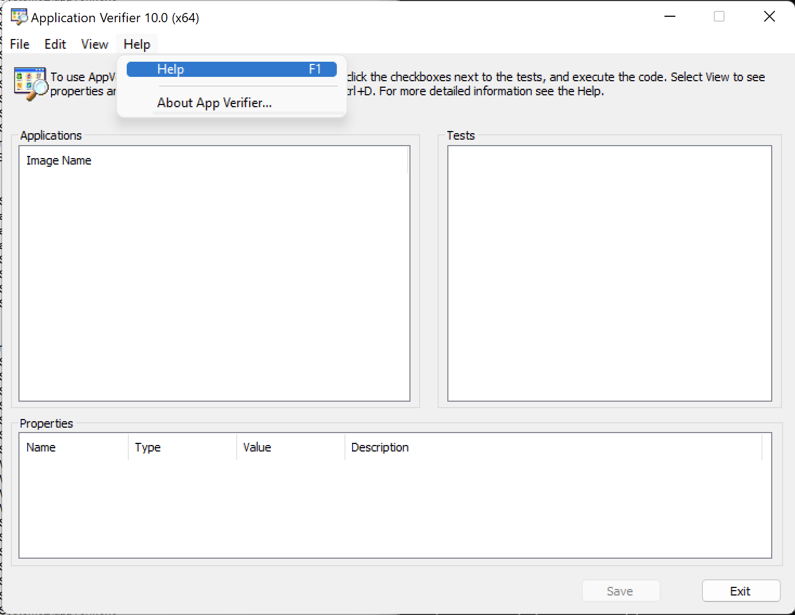

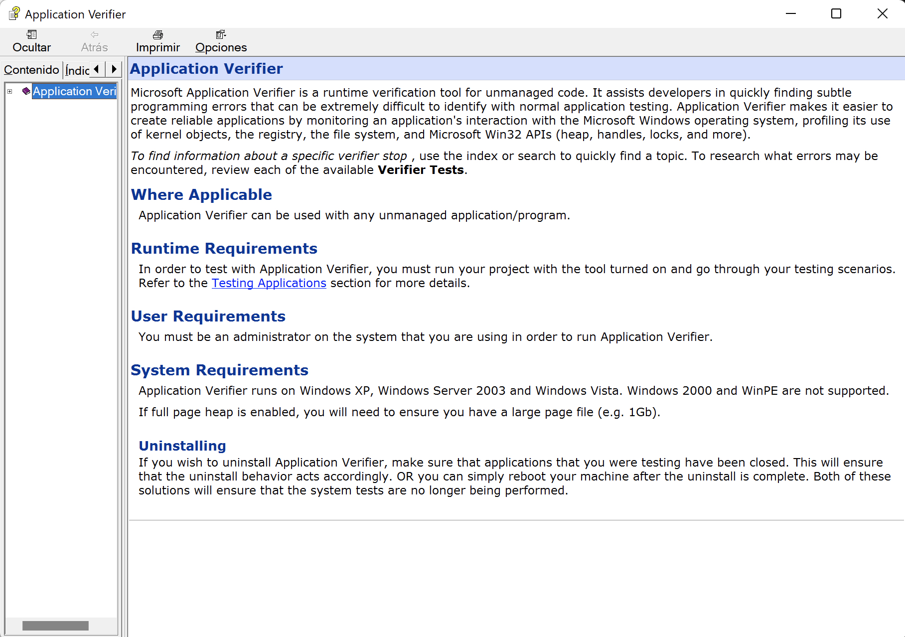

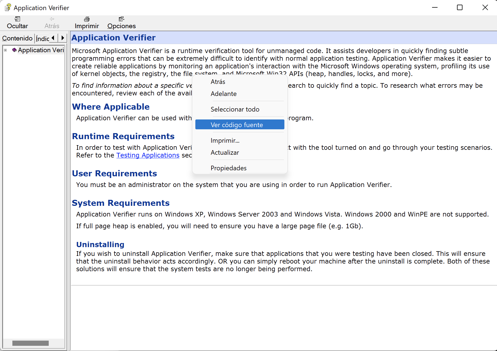

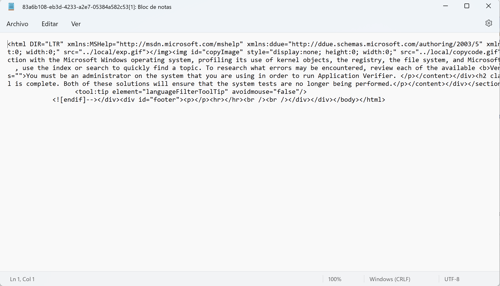

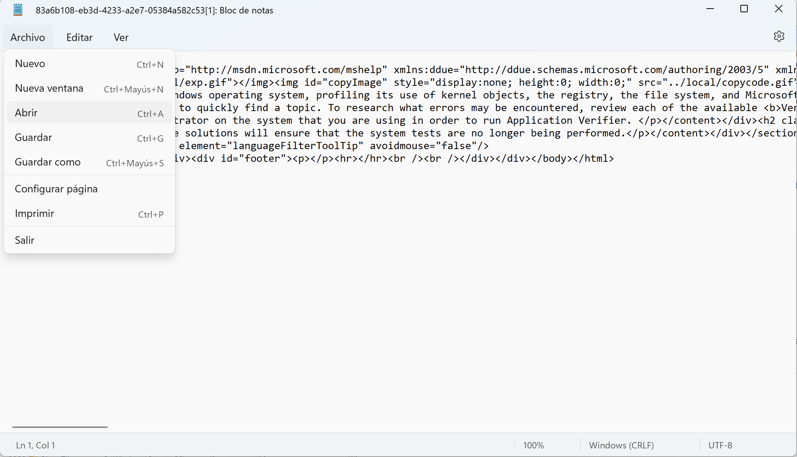

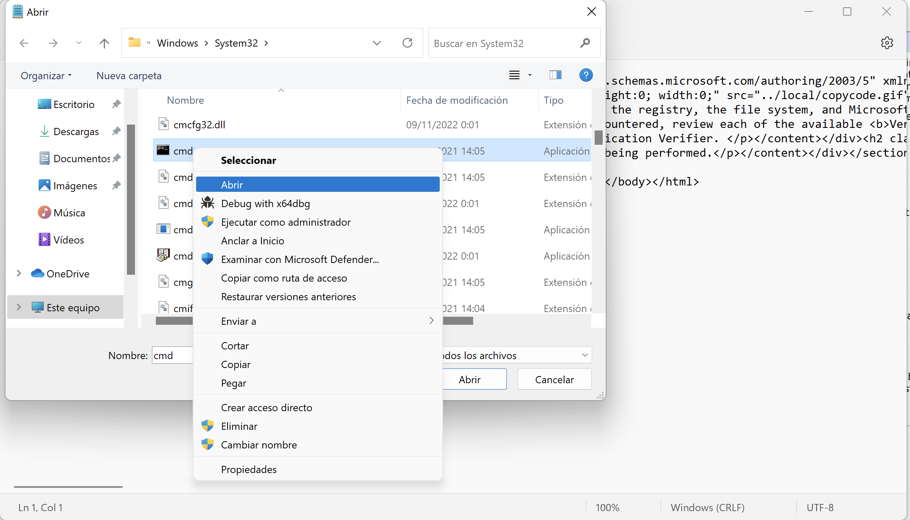

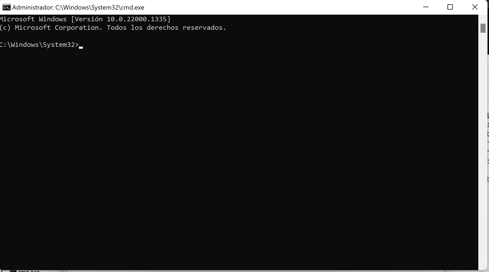

Si revisamos con Process Monitor, la operación de Process Create podemos observar como el nivel de integridad pasa de Medium a High.

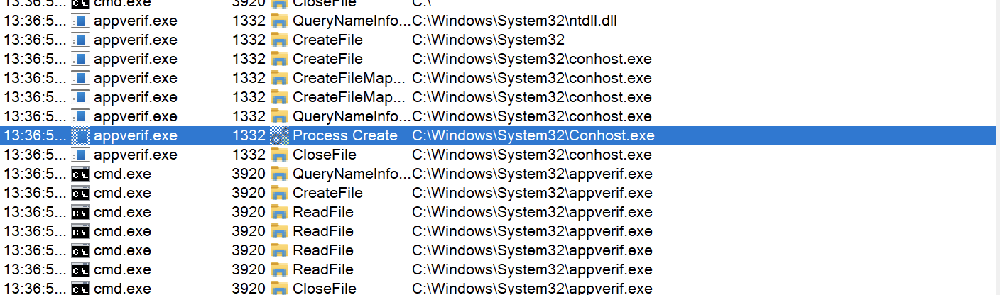

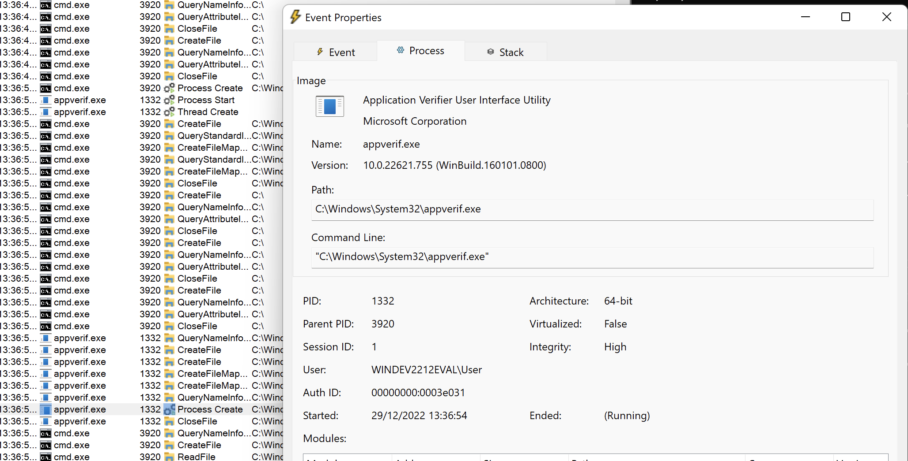
